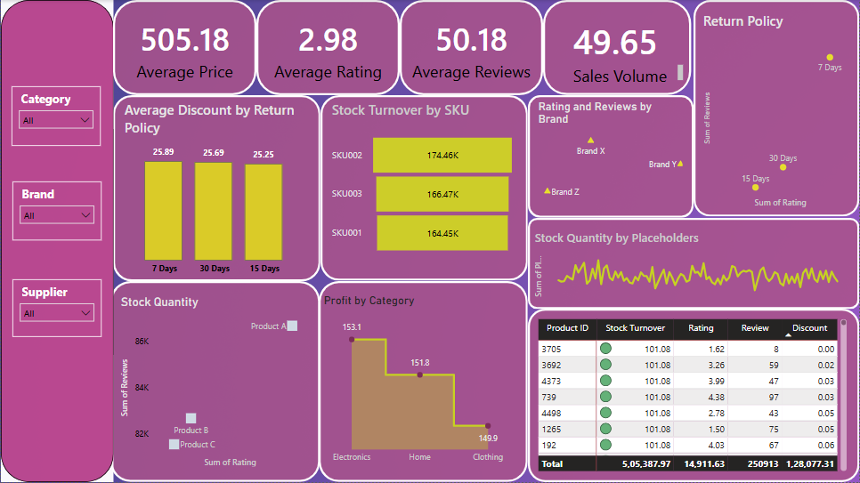

# Product Analytics Dashboard

A comprehensive analysis of product data with SQL queries and Power BI visualization.

## Project Overview

This repository contains:
- SQL queries analyzing product pricing, ratings, inventory, and return policies
- Power BI dashboard visualizing key product metrics
- Data insights and business recommendations

## Data Source

## Key Analyses Performed

1. **Premium Product Identification**: Finds products priced above category average
2. **Category Rating Analysis**: Compares average ratings across product categories
3. **Warehouse Popularity**: Identifies most reviewed products by warehouse
4. **Pricing Strategy**: Analyzes price distribution with discounts and suppliers
5. **Top Rated Products**: Ranks products by customer ratings within categories
6. **Return Policy Impact**: Evaluates stock levels and ratings by return policy

## Python EDA

- Data cleaning (handling missing values, outliers)
- Statistical analysis
- Visualization of key metrics

## SQL Analysis Highlights

- 6 comprehensive analytical queries
- Detailed interpretations of each analysis
- Actionable business suggestions
- Advanced techniques like window functions and CTEs

## Power BI Dashboard Features

- Interactive visualizations of product metrics
- Category-wise performance comparison
- Price distribution analysis
- Rating trends visualization
- Inventory management insights

## How to Use

1. **SQL Analysis**:
   - Run the `Productdata.sql` in your SQL environment
   - Connect to your product database (schema may need adjustment)

2. **Power BI Dashboard**:
   - Open `Product_Analysis.pbix` in Power BI Desktop
   - Connect to your data source (may need path updates)

## Technical Requirements

- SQL Server Management Studio or similar SQL client
- Power BI Desktop (latest version recommended)
- Sample dataset available in Data-Samples/ folder

## Future Enhancements

- Add more dynamic parameters to SQL queries
- Incorporate real-time data refresh in Power BI
- Expand analysis to include sales data
- Add customer segmentation analysis

## Contributing

Contributions welcome! Please fork the repository and submit pull requests.

##Contact

janviambazhakan@gmail.com 
